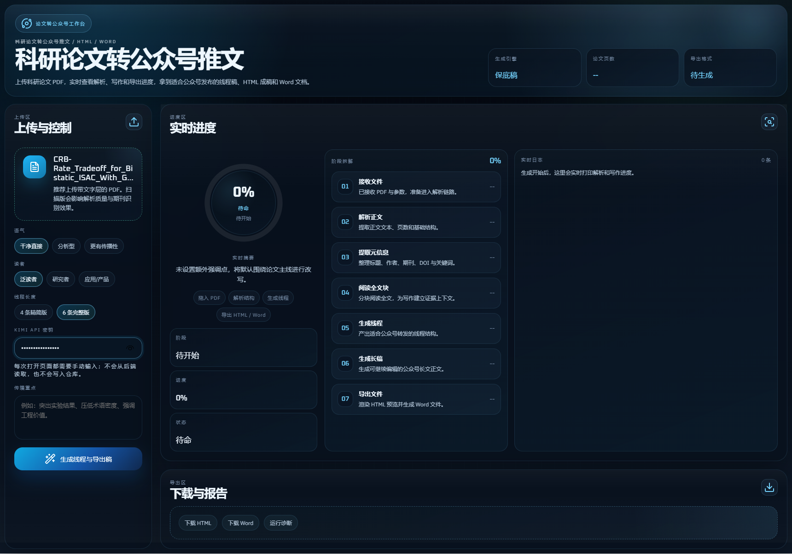
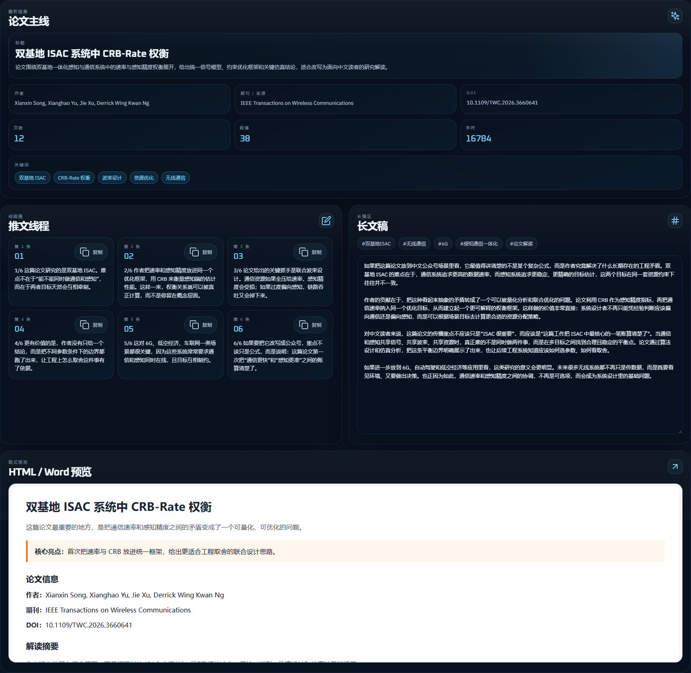

# 科研论文转公众号推文

把科研论文 PDF 快速转成适合中文公众号发布的推文线程、长文首稿、HTML 排版稿和 Word 交付稿。

## 项目定位

这个项目不是通用写作器，而是面向中文科研传播场景的内容转写工作台。它更适合把论文原文转换成公众号可继续编辑和排版的首稿。

适合使用的公众号类型：

- 科研普及号：把论文讲清楚，面向学生、跨专业读者和技术爱好者
- 高校 / 实验室官方号：发布本组论文解读、成果速递、项目阶段进展
- 学术资讯号：做论文推荐、方向追踪、热点综述
- 产业技术号：把通信、AI、机器人、材料、生医等论文改写成行业可读内容
- 企业研发品牌号：输出“技术洞察 + 应用价值”型内容
- 投资 / 产业研究号：从论文中提炼方向判断、技术意义和落地场景

不太适合的内容类型：

- 纯新闻快讯
- 与论文无关的泛热点内容
- 强营销文案
- 需要大量采访或故事化叙事的稿件

## 前端界面

### 工作台总览



### 结果与导出页



## 功能

- 上传论文 PDF 并解析全文结构
- 提取标题、作者、期刊、DOI、关键词和章节信息
- 调用 Moonshot / Kimi 生成中文推文线程和长文稿
- 导出 HTML 和 `.docx`
- 在前端实时显示解析、写作和导出进度

## Kimi 密钥规则

- 应用不会使用后端保存的默认 Kimi key
- 必须在前端页面手动输入你自己的 `Kimi API Key`
- 密钥只在当前页面请求中使用，不会写入仓库
- `backend/.env` 不应提交到 GitHub

## 项目结构

```text
research-workbench/
├─ backend/                 Express API、PDF 解析、LLM 调用、导出逻辑
├─ frontend/                Next.js 前端工作台
├─ docs/
│  └─ screenshots/          README 使用的界面截图
├─ .gitignore
├─ Launch-Dev.cmd
├─ Stop-Dev.cmd
└─ README.md
```

## 本地启动

### 一键启动

Windows 下可以直接双击根目录的 `Launch-Dev.cmd`。

它会自动：

- 清理占用 `3000/3001` 的旧进程
- 在缺少依赖时执行 `npm install`
- 启动前端和后端
- 自动打开 `http://localhost:3000`

关闭时双击 `Stop-Dev.cmd` 即可。

### 手动启动

后端：

```powershell
cd backend
npm install
npm start
```

默认地址：`http://localhost:3001`

前端：

```powershell
cd frontend
npm install
npm run dev
```

默认地址：`http://localhost:3000`

### 使用流程

1. 打开 `http://localhost:3000`
2. 上传论文原文 PDF
3. 手动输入你的 `Kimi API Key`
4. 点击“生成线程与导出稿”
5. 下载 HTML 或 Word，并继续编辑长文稿

## 发布到 GitHub 前确认

- `backend/.env` 不存在或不包含真实密钥
- `node_modules`、`.next`、日志、导出文件不会提交
- 根目录只保留源码、截图、说明文档和必要脚本

## 技术栈

- Frontend: Next.js 14, React 18, TypeScript
- Backend: Node.js, Express
- Export: `docx`
- LLM: Moonshot / Kimi

## 开源协议

本项目使用 [MIT License](LICENSE)。
